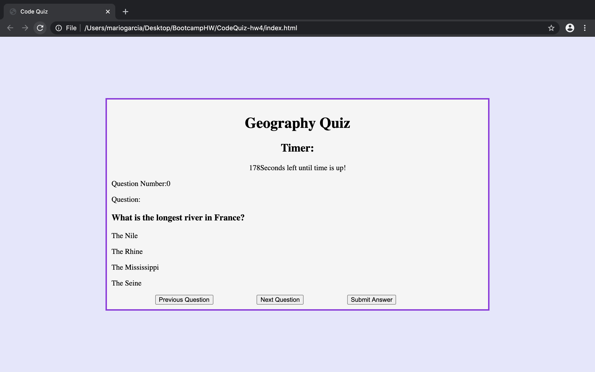

# CodeQuiz-hw4
Web APIs

## Repository Github Link:
https://github.com/analuna01/CodeQuiz-hw4.git

## Deployed Website Link:
https://analuna01.github.io/CodeQuiz-hw4/

### Comments:
The purpose of this assignment was to create a quiz with a variety of questions and multiple choice answers. This was the first assignment that we had to create HTML, CSS, and JavaScript files from scratch. 

### Screenshot of Deployed App:

<<<<<<< HEAD

=======

>>>>>>> 90662d23c0aa08015c8997e881ff4e92a87af35d
